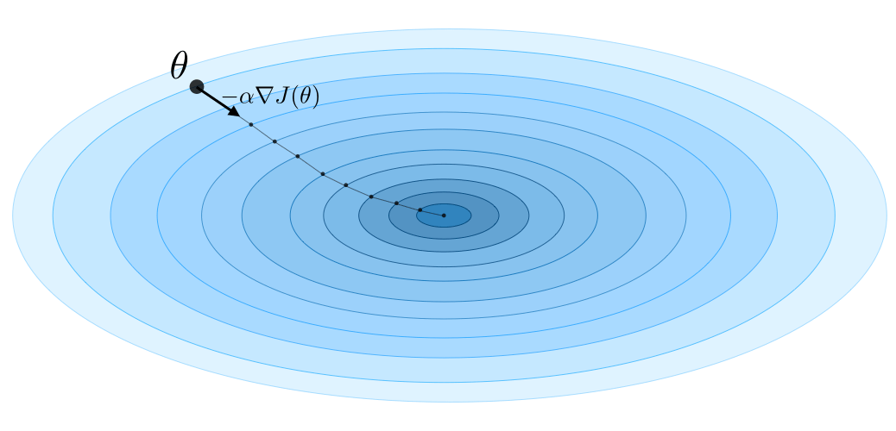
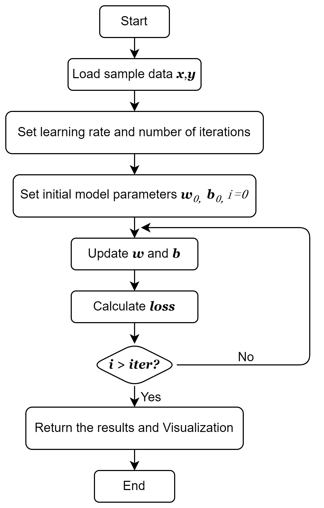
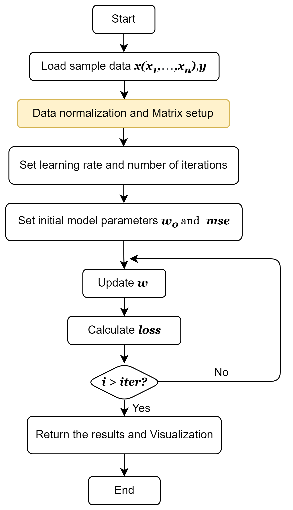

# GradientDescent Package
This package includes two functions to implement linear regression using gradient descent for both one-dimensional and multi-dimensional data.

## 1. Introduction to Gradient Descent
Gradient descent is one of the most commonly used optimization algorithms in machine learning and neural networks. Its primary goal is to minimize the error between the predicted results and the actual results by iteratively adjusting the model's parameters. 

The core idea of gradient descent is to calculate the derivative (gradient) of the loss function with respect to the model's parameters, then update the parameters in the direction opposite to the gradient. This process is repeated iteratively until the algorithm converges to the optimal solution.

The main **formula** for gradient descent is as follows:

```math
[\theta := \theta - \alpha \cdot \nabla_{\theta} J(\theta)]
```

with:
- $\theta\$ represents the model parameters.
- $\alpha\$ is the learning rate, controlling the step size of each update.
- $J(\theta)\$ is the loss function, used to measure prediction error.
- $\nabla_{\theta} J(\theta)\$ denotes the gradient of the loss function with respect to the parameters.

Through multiple iterations, gradient descent gradually finds the parameter values that minimize the loss function, thus improving the accuracy of the model's predictions.

<div align=center></div>

The diagram illustrates this process. The blue curve represents the contour lines (level sets) and the arrows indicate the direction opposite to the gradient at that point. (Note: The gradient direction at a point is perpendicular to the contour lines passing through that point). By following the gradient descent direction, we will eventually reach to the bottom, which is the point where the loss function J is minimized.
***
## 2. Linear regression using gradient descent
In this R package, we focus on the application of gradient descent in both univariate and multivariate functions. To this end, we provide two functions, **GD_one_dim** and **GD_multi_dim**, to implement linear regression and also offer visualizations.

### 2.1 Convex Function
The concept of convex functions should to be introduced to simplify the optimization process, because the minimization problem of a convex function has uniqueness, meaning that a strictly convex function over a convex open set can have at most one local minimum and finding a local minimum on a convex function will also yield a global minimum. 

The main **formula** for convex functions of one variable $f(x)$ is as follows: 
```math
x^{(k+1)}~=~x^{(k)}~-~\eta\frac{df(x)}{dx}
```

The main **formula** for convex functions of several variable $f(x,y)$ is as follows: 
```math
x^{(k+1)}~=~x^{(k)}~-~\eta\frac{\partial f(x,y)}{\partial x}
```
```math
y^{(k+1)}~=~y^{(k)}~-~\eta\frac{\partial f(x,y)}{\partial y}
```

The essence of gradient descent is to find the extremum and numerical solution of a function. For machine learning algorithms, as long as the loss function can be expressed as a convex function, gradient descent can be used to update the weight vector $w$ at the fastest rate, thereby finding the point where the loss function reaches its minimum.

### 2.2 GD_one_dim Function
In the case of a simple linear regression problem, the original function is a single-variable function (with respect to x), and its loss function is a two-variable function (with respect to w and b). Therefore, we can transform the simple linear regression problem into a two-variable extremum problem.

The **formula** for single-variable function: 
```math
y=wx+b
```

The **formula** for solving two-variable extremum problem:
```math
\arg\min_{w,b} Loss(w,b)
```
```math
Loss=\frac{1}{2}\sum_{i=1}^{n}(y_i-(wx_i-b))^2
```

The **formula** for parameter update algorithm for this model:
```math
w^{(k+1)}~=~w^{(k)}~-~\eta\sum_{i=1}^{n}x_i(wx_i+b-y_i)
```
```math
b^{(k+1)}~=~b^{(k)}~-~\eta\sum_{i=1}^{n}(wx_i+b-y_i)
```

The **Simplified Process** for this function:

1. Initialization:
   * Set hyperparameters: $learning$ $rate$ and $number$ $of$ $iterations$
   * Set initial model parameters: $w_0$ , $b_0$

2. Training the model:
   * Repeat $iter$ times:
     * Calculate gradients (partial derivatives of $w$ and $b$)
     * Update parameters $w$ and $b$
     * Calculate and record the loss (MSE)
     * Periodically display the current iteration's parameters and loss

3. Visualizing the results:
   * plot scatterplot
   * Plot loss graph
   * Plot comparison between actual and predicted values

4. Return:
   * Return the final loss value and the list of losses across all iterations

The **Simplified Flowchart** for this function:

<div align=center></div>

To better understand the working principle of the *GD_one_dim* function in this R package, the workflow analysis and flowchart are outlined above. The more detailed explanation about parameters and output can be seen in [Vignettes](vignettes/my-vignette.Rmd "Vignettes") and the step-by-step analysis is in [Gradient.R](R/Gradient.R "Gradient.R").


**Summary**

This function performs one-dimensional linear regression using gradient descent. It iteratively adjusts the weight $w$ and bias $b$ to minimize the loss function. Users can specify the learning rate, the number of iterations, and the display interval. In each iteration, the function computes the model's predictions and loss, and at the end, it visualizes the regression line, the change in loss over iterations, and the difference between the predicted and actual values.

### 2.3 GD_multi_dim Funtion
In the case of a multiple linear regression problem, both $X$ and $W$ are vectors of dimension m+1. The loss function is a convex function in a high-dimensional space, so we can first transform the multiple linear regression function into a matrix equation before solving it.

The **formula** for single-variable function: 
```math
\hat{Y}=XW
```
with:
```math
W=(w_0,w_1,\cdots,w_m)^T
```
```math
X=(x^0,x^1,\cdots,x^m)^T
```

The **formula** for loss function:

```math
Loss=\frac{1}{2}(Y-\hat{Y})^2=\frac{1}{2}(Y-XW)^2
```

The **formula** for weight update algorithm for this model:
```math
W^{(k+1)}~=~W^{(k)}~-~\eta\frac{\partial Loss(W)}{\partial W}
```
with:
```math
\frac{\partial Loss}{\partial W}=X^T(XW-Y)
```
then equal to:
```math
W^{(k+1)}~=~W^{(k)}~-~\eta X^T(XW-Y)
```

The **Simplified Process** for this function:

1. Data Preparation:
   * Normalize the data in $x$

2. Matrix Setup:
   * Create feature matrix $X$ and target matrix $Y$

3. Initialization:
   * Set hyperparameters: $learning$ $rate$ and $number$ $of$ $iterations$
   * Set initial model parameters: weight $w_0$ , loss vector $mse$

4. Training the model:
   * Repeat $iter$ times:
     * Compute gradients and update weights
     * Predict values and calculate the loss
     * Store the loss and print every $display$ _ $step$ iterations

5. Visualizing the results:
   * Plot the loss over iterations 
   * Plot comparison between actual and predicted values

6. Return:
   * Return the final loss value and the list of losses across all iterations

The **Simplified Flowchart** for this function:

<div align=center></div>

To better understand the working principle of the *GD_multi_dim* function in this R package, the workflow analysis and flowchart are outlined above. The working principles of *GD_multi_dim* and *GD_multi_dim* are generally similar. The main difference is that in *GD_multi_dim*, because there is more than one independent variable, normalization of the data and creation of matrices are required before training the model. This difference is also highlighted in the flowchart. Same as *GD_one_dim* function, the more detailed explanation about parameters and output can be seen in [Vignettes](vignettes/my-vignette.Rmd "Vignettes") and the step-by-step analysis is in [Gradient.R](R/Gradient.R "Gradient.R").
**Summary**

This function implements multi-dimensional linear regression for multiple features (variables). After normalizing the data, it uses matrix operations to perform gradient descent, updating the weight matrix $W$. Users can set the learning rate, the number of iterations, and the display interval. The function outputs the change in loss during training and plots the comparison between predicted and actual values.

Both functions use gradient descent to train the model, making them useful for linear regression tasks with intuitive visualizations to analyze convergence and predictive performance.
***
## 3. Vignettes and Tests
This R package also includes two important components: vignettes and tests, which help us better understand and use this package. 

In the vignettes, we will learn how the package works through a simple example, as well as a detailed introduction about the input, parameters, final output and visualization graphics in both two functions. 

In the tests, to test the validation and accuracy of this package, the outputs will be compared with another widely-used package 'lm', using data from an open dataset in the [Medical Cost Personal Datasets (kaggle.com)](https://www.kaggle.com/datasets/mirichoi0218/insurance). 

***
Thank you for reading this introduction, hope you have fun with this r package! :wink:
